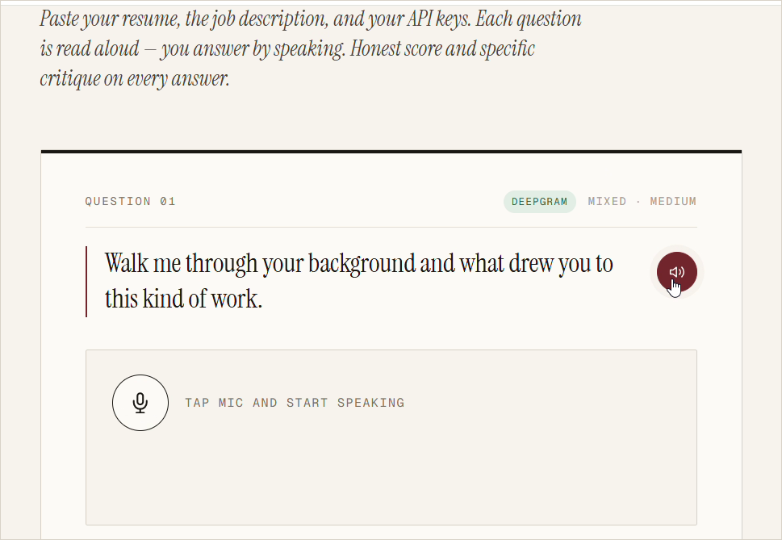
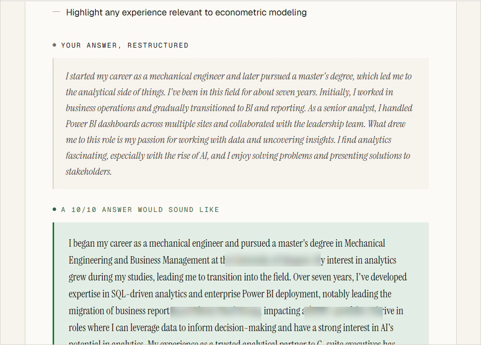
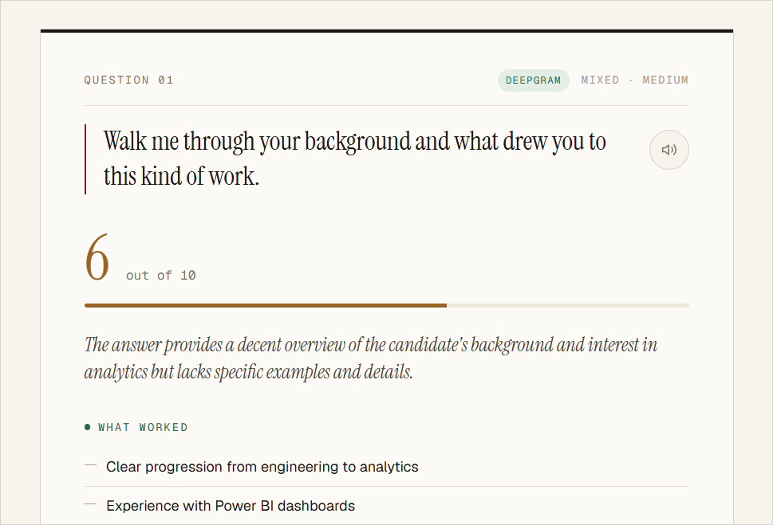
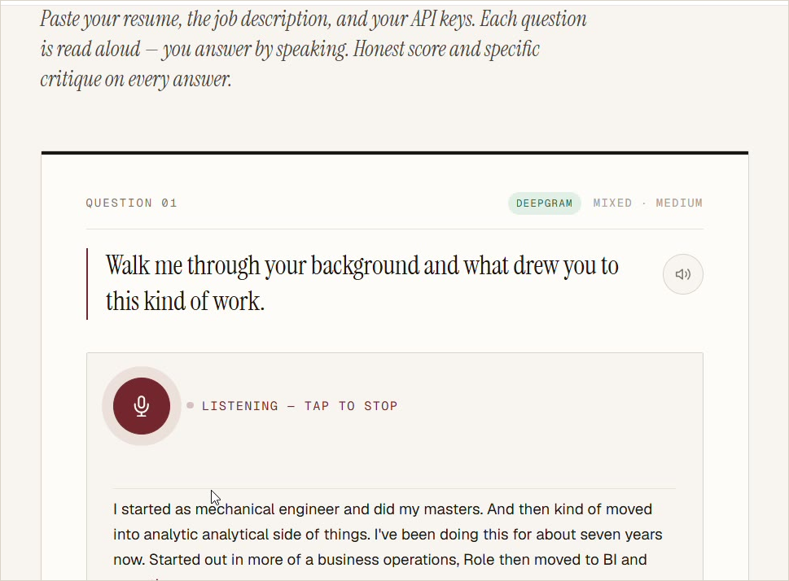

# 🎤 Interview Coach — Practice Your Interview Out Loud, With AI

> Rehearse real interview questions **out loud**, and get an honest score and specific feedback on every answer — generated from *your* resume and *your* target job.

**[▶️ Try the live demo](https://praneel95.github.io/lets-prepare-for-that-interview/)** · No install, no sign-up. Bring your own API key and go.

---

## Why this exists

Most interview prep is reading lists of questions. But interviews aren't read — they're **spoken**, under mild pressure, on the spot. The gap between "I know what to say" and "I can say it cleanly out loud" is where good candidates lose offers.

This tool closes that gap. It runs a realistic spoken interview: questions are **read aloud**, you **answer by talking**, and an AI hiring manager scores each answer 1–10 with concrete strengths, shortcomings, a cleaned-up version of what you said, and a model 10/10 answer drawn from your actual resume.

Everything runs in **one HTML file in your browser**. There is no backend, no tracking, and no account.

## How it works

**1. A question is generated from your resume and the job, then read aloud.**

**2. You answer out loud — your speech is transcribed live as you talk.**

**3. You get an honest score and specific feedback — not just praise.**

> The demo above scores a **6/10** — on purpose. The feedback is real, so a so-so answer gets a so-so score, with concrete notes on how to push it higher.

**4. And here's the best part — it rewrites your answer into a 10/10 version, using your real background.**

> Two rewrites every time: your own answer cleaned up, and a polished model answer drawn from *your* resume — so you can hear the gap and close it. (A few personal details are blurred in this screenshot.)

## What it does

- 🗣️ **Spoken practice** — questions read aloud via text-to-speech; you answer with your voice.
- 📝 **Tailored questions** — generated from your resume + the job description, following a natural interview arc (warm-up → behavioral → role-specific → tough probes).
- 🎯 **Honest scoring** — every answer gets a 1–10 score, a verdict, what worked, what didn't, and how to improve.
- ✨ **Two rewrites per answer** — your answer cleaned up in your own voice, plus a polished 10/10 example using your real background.
- 🎛️ **Tunable** — pick a style (behavioral / technical / situational / mixed) and difficulty (warm-up / realistic / tough panel).
- 🔌 **Bring Your Own Key** — works with **OpenAI** *or* **Claude (Anthropic)**. Paste one key; it auto-detects which.
- 🎧 **Better transcription, optionally** — add a Deepgram key for high-quality speech recognition, or use your browser's built-in recognition for free.

## Quick start

1. **[Open the live demo](https://praneel95.github.io/lets-prepare-for-that-interview/)** — or download `index.html` and open it locally.
2. Paste your **resume** and the **job description**.
3. Paste **one** API key:
   - **OpenAI** — starts with `sk-` · [get a key](https://platform.openai.com/api-keys)
   - **Claude** — starts with `sk-ant-` · [get a key](https://console.anthropic.com/settings/keys)
4. Pick a style and difficulty, hit **Begin**, and start talking.

> 💡 Best in Chrome, Edge, or Safari (these support in-browser speech recognition and text-to-speech).

## Privacy & security — read this

This is a **client-side BYOK** tool. Your key stays in your browser tab and is sent **directly** to the AI provider you chose. It never goes to the repo author, to GitHub, or to any other server — there is no server. You can read the entire source in `index.html` and verify exactly that.

Because the key lives in the page while you use it, please:

- Run it **locally or from a host you trust**.
- Use a key with **spending limits**, and revoke it if in doubt.
- Note that Claude calls use the `anthropic-dangerous-direct-browser-access` header to permit direct browser requests — the "dangerous" is Anthropic's reminder that any in-browser key is visible to the page (the same is true of an OpenAI key).

Want zero in-browser key exposure? Put a tiny proxy in front that holds the key server-side. That's the natural first contribution if someone wants one (see below).

## Models

| Provider  | Default model       | Where to change it                          |
|-----------|---------------------|---------------------------------------------|
| OpenAI    | `gpt-4o`            | `OPENAI_MODEL` constant in `index.html`     |
| Anthropic | `claude-sonnet-4-6` | `ANTHROPIC_MODEL` constant in `index.html`  |

## Make it yours

This is **one readable file** on purpose — it's meant to be forked and tweaked. A few ideas to get you started:

- 🧩 Add another provider (Gemini, Mistral, a local model via Ollama).
- 🛡️ Add an optional backend proxy so keys never touch the browser.
- 🌍 Add languages / non-English interviews.
- 📄 Export the session summary as a PDF.
- 🎨 Restyle it — the whole design is CSS variables at the top.
- 📊 Track scores across sessions to show improvement over time.

See **[CONTRIBUTING.md](CONTRIBUTING.md)** — issues and PRs of every size are genuinely welcome, including "I tried it and X was confusing." If this helped you land an interview, a ⭐ helps other people find it.

## License

[MIT](LICENSE) — use it, change it, ship it, sell it. Just keep the license notice.

---

Keywords: AI mock interview, spoken interview practice, interview preparation tool, behavioral interview STAR practice, resume-based interview questions, OpenAI / Claude interview coach, browser BYOK app.
